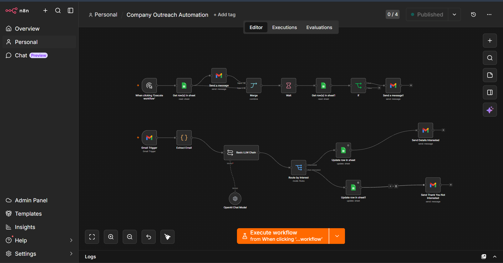
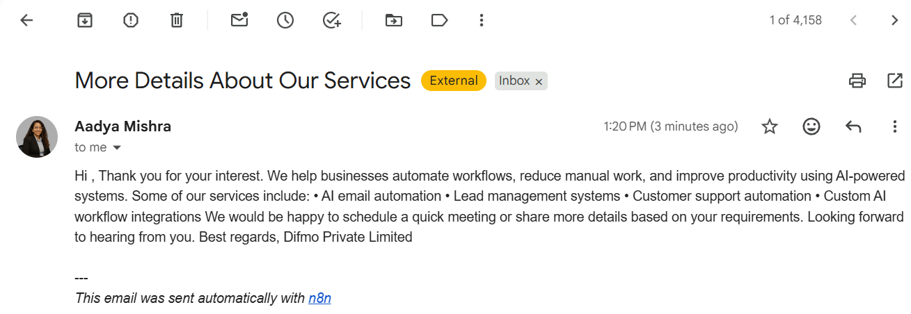
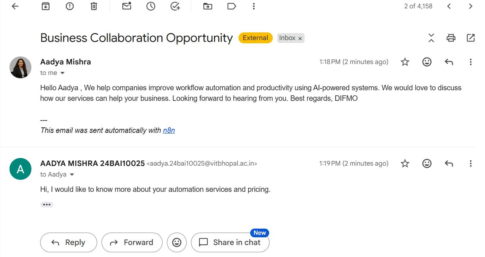

# AI Company Outreach Automation

An AI-powered outreach automation system built using **n8n**, **OpenAI**, **Gmail API**, and **Google Sheets**.

This workflow automates:

* Cold outreach emails
* Smart follow-up emails
* AI-based reply understanding
* CRM status tracking
* Interested / Not Interested routing

---

# Features

✅ Automated outreach emails
✅ AI-powered reply analysis
✅ Automatic follow-up system
✅ Gmail reply detection
✅ Google Sheets CRM tracking
✅ Interested / Not Interested classification
✅ Automatic detailed response emails

---

# Tech Stack

* n8n
* OpenAI API
* Gmail API
* Google Sheets API

---

# Workflow Architecture

## Outreach Workflow

1. Fetch leads from Google Sheets
2. Send outreach emails
3. Wait for replies
4. Check response status
5. Send follow-up if no reply received

---

## AI Reply Handling Workflow

1. Detect incoming Gmail replies
2. Extract sender email
3. Analyze user intent using OpenAI
4. Route user based on interest
5. Send detailed information or thank-you email
6. Update CRM automatically

---

# Workflow Screenshot

---

# Automated Reply Example

---

# Interested Reply Example

---

# AI Classification Examples

| User Reply                         | AI Classification |
| ---------------------------------- | ----------------- |
| "Can you share pricing?"           | Interested        |
| "Tell me more about your services" | Interested        |
| "Not looking currently"            | Not Interested    |
| "We already use another solution"  | Not Interested    |

---

# Future Improvements

* CRM integrations
* Slack/Discord notifications
* Analytics dashboard
* AI-generated personalized outreach
* Auto meeting scheduling

---

# Author

Aadya Mishra
